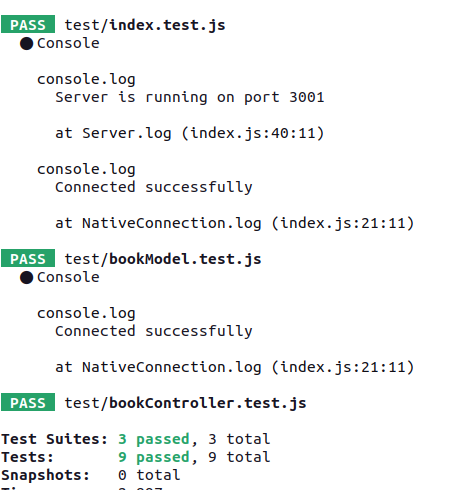

# Reading List App

A simple web application to manage your reading list, built with Node.js, React, and MongoDB.

## Features

- **Browse Reading Lis**t: View a list of books with details.

- **Add New Book**: Easily add a new book to your reading list.

- **Remove from List**: Delete books from your reading list when you're done or decide not to read them.

- **Track Reading Progress**: Update the status of a book to Unread, In Progress, or Finished.

- **Dynamic Icon Changes**: The book icon dynamically changes based on its status. For example, it could display different book icons for Unread, In Progress, and Finished statuses.
  
- **Favorite Marking**: Mark a book as a favorite, with the favorite icon turning red for easy identification.


## Prerequisites

Before you begin, ensure you have met the following requirements:

- Node.js installed
- NPM or Yarn installed
- MongoDB instance (local or [MongoDB Atlas](https://www.mongodb.com/cloud/atlas)).

## Getting Started

1. Clone the repository:

```bash
git clone https://github.com/your-username/reading-list-app.git
cd reading-list-app

```

### Navigate to the server directory and start server


```
cd server
npm start
```

### Navigate to the client directory and start application

```
cd client
npm install
npm start
```

Visit http://localhost:3000 to view the app.


### Run tests

```
    stop application
    cd server
    npm test
```

you should see output:



## Built With

- Node.js - Server-side JavaScript runtime
- Express - Web framework for Node.js
- React - JavaScript library for building user interfaces
- MongoDB - NoSQL database
- Mongoose - MongoDB object modeling for Node.js

## Authors

Kristina Matuleviciute

## License

This project is licensed under the MIT License - see the LICENSE.md file for details.
